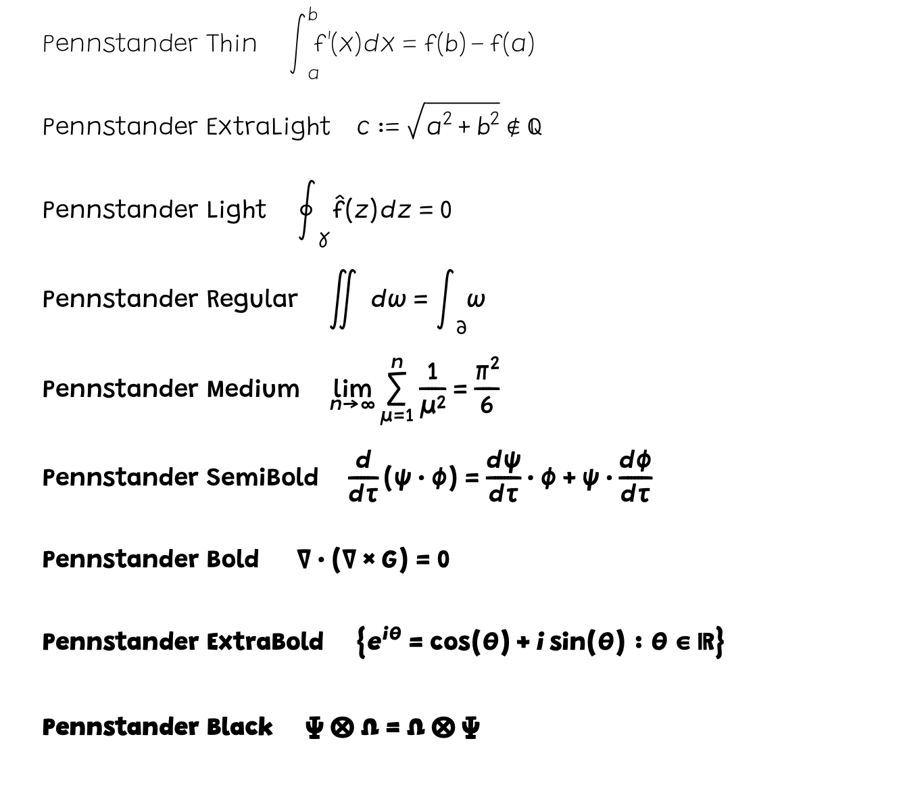

# Pennstander
An opentype mathematics font based on Grandstander by Tyler Finck, aimed at LuaLaTeX and ConTeXt.   Beta version, comments/bugs/advice welcome.



## Features
Latin and Greek lower and upper case in upright and oblique/italics
Doublestruck upper case
Integrals including display and extended
Mathematical Operators including display
Mathematics Accents
Arrows and stackers
Radicals
Mathematical symbols

## ConTeXt
Sample usage for ConTeXt MKIV
```
\usetypescriptfile[type-imp-pennstander]
\setupmathfractions[symbol="E000] %recommended but optional
\setupalign[profile] %recommended but optional
\setupinterlinespace[14pt] %recommended but optional
\setupbodyfont[Pennstander-Thin] %replace 'Thin' with 'ExtraLight','Light',...
\starttext
\startformula
\int_a^b \frac{df}{dx} dx = f(b) - f(a)
\stopformula
\stoptext
```

## LuaLaTeX
Sample usage
```
\documentclass[12pt]{article}

\usepackage{unicode-math}
\setmainfont[
BoldFont =Pennstander-Light.otf,   
ItalicFont = Pennstander-ItalicThin.otf, 
BoldItalicFont = Pennstander-ItalicLight.otf
]
{Pennstander-Thin.otf}

\setmathfont[
script-font  = PennstanderMath-Thin-script.otf,
sscript-font  = PennstanderMath-Thin-sscript.otf,
]{PennstanderMath-Thin.otf}

\begin{document}
Here is some {\bf bold} and some {\it italics} and an equation
\[ \int_a^b {\bf f}'(x) dx= {\bf f}(b) - {\bf f}(a)\]
\end{document}
```
